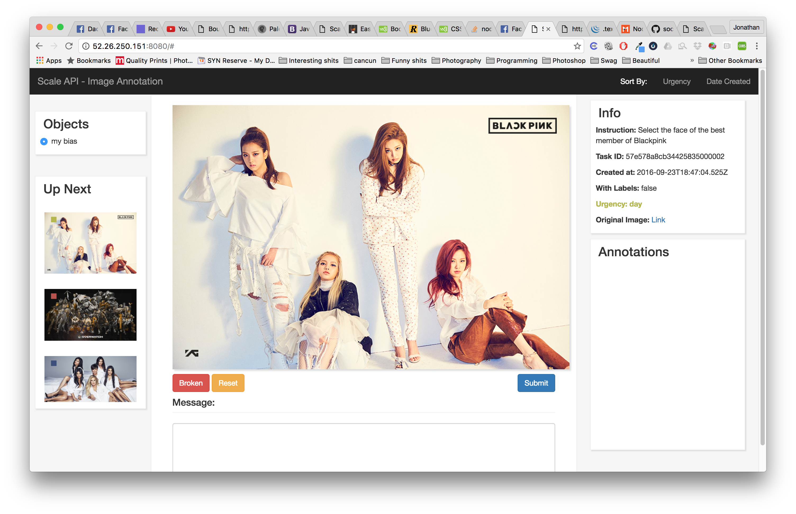

# ScaleAPI - Image Annotation MVP

## Setup

I assume you have Ubuntu 14.04

Install Node
```
curl -sL https://deb.nodesource.com/setup_4.x | sudo -E bash -
sudo apt-get install -y nodejs
```

Install MongoDB
```
sudo apt-key adv --keyserver hkp://keyserver.ubuntu.com:80 --recv EA312927
echo "deb http://repo.mongodb.org/apt/ubuntu trusty/mongodb-org/3.2 multiverse" | sudo tee /etc/apt/sources.list.d/mongodb-org-3.2.list
sudo apt-get update
sudo apt-get install -y mongodb-org

```

Clone the repository
```
git clone https://github.com/JohnnyJohnAndTheFunkyBunch/imgbox.git
```
Then install the packages and run `server.js`

```
npm install
node server.js
```

## Using the web app
The server should be served on port `80`. You can then open the web app through `[your ip address]:80` and it should look something like this:



## Using the annotation API entry point
Just like the real ScaleAPI, you curl using these parameters:
```
curl "http://[your ip address]/api/task/annotation" \
  -u YOUR_API_KEY: \
  -d callback_url="http://www.example.com/callback" \
  -d instruction="Draw a box around each baby cow and big cow." \
  -d attachment_type=image \
  -d attachment="http://i.imgur.com/v4cBreD.jpg" \
  -d objects_to_annotate="baby cow" \
  -d objects_to_annotate="big cow" \
  -d with_labels=true
```

## Features that might not be obvious
* Picture scale automatically to fit the webpage, bounding boxes are still in reference to the orginal image size
* Press R for reset
* Press Space or Enter to submit
* Press Broken to write a message to why the task is invalid
* You can click on an image on "Up Next" to change image to work on
* You can sort by urgency or creation date
* The left corner of the thumbnail represets the Urgency level

## Features to implement
* Color code the bounding boxes depending on the object
* Annotated image page to see all the images annotated
* Session information
* Be able to delete annotations through Annotations Box
* Better feedback on submit to feel like you did something great
